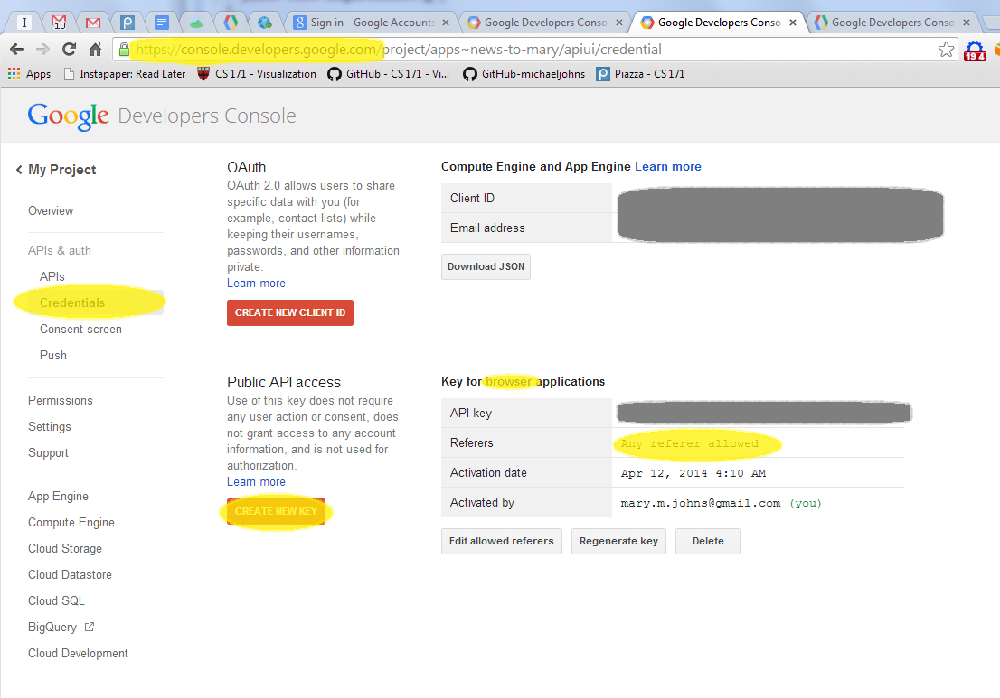

# Crisis-Coverage Project: Google API Custom Search Engine Overview
A Google API key to be used in RESTful queries, e.g. `&key=__%YOURKEY%__` can be set up rather quickly for a user to run queries against our two established Google Custom Search Engines (see [documentation](https://developers.google.com/custom-search/json-api/v1/overview)) -- [AllGoogle](https://www.google.com/cse/publicurl?cx=007061251080714295857:fevheb09whc) with cx `&cx=007061251080714295857:fevheb09whc` and [AllCrisisCoverage](https://www.google.com/cse/publicurl?cx=007061251080714295857:nhvoqbzpcim) with cx `&cx=007061251080714295857:nhvoqbzpcim`. The API key can be generated from your gmail account by going to [Google Developer Console](https://console.developers.google.com). Once you get to the page, it will require you to create a project which is any name or phrase which acts as  a container for services, e.g. "news-to-mary" or "my-project", the name really is not important. Then you will see the developer's console. Click on "Credentials", then "Create New Key" for Browser, and don't add any restrictions in the text area that appears with the create dialog, referencing the screenshot below. 

The API key is afforded 100 queries per day, with 10 results for each query in the free tier. As long as the account you create the key for is not manually upgraded to paid tiers, there is no way to end up in a situation where you are in trouble or owe as the Google servers just give a 503 error for 101+ queries within a day. Also, it is important to note that the free tier maxes out at 100 results per query, meaning that you simply cannot see results 101+ for a given time period queried. Due to this restriction, it is important to use smaller time windows (i.e. days or weeks) in order to obtain more results.



As mentioned, the API key is used to call pre-existing Custom Search Engines. We have established 2 of importance to our efforts:
1. [AllGoogle](https://www.google.com/cse/publicurl?cx=007061251080714295857:fevheb09whc) is what we had used to get through our initial prototyping and is used to search all of Google (i.e. useful for Country choropleth). ___Note: this is the only cx we are able to use in API calls due to Google restrictions.___
2. [AllCrisisCoverage](https://www.google.com/cse/publicurl?cx=007061251080714295857:nhvoqbzpcim) which we set up to mimic our specially tracked [media sites](../productiondata/media-sites.tsv) with a nod to sources around the world (though english speaking heavy). ___Note: this cx is not used in API calls but is useful for embedding our custom search engine on our website.___

Here is the code to embed the 'AllCrisisCoverage' search engine which includes our specially tracked sites:
```html
<script>
  (function() {
    var cx = '007061251080714295857:nhvoqbzpcim';
    var gcse = document.createElement('script');
    gcse.type = 'text/javascript';
    gcse.async = true;
    gcse.src = (document.location.protocol == 'https:' ? 'https:' : 'http:') +
        '//www.google.com/cse/cse.js?cx=' + cx;
    var s = document.getElementsByTagName('script')[0];
    s.parentNode.insertBefore(gcse, s);
  })();
</script>
<gcse:search></gcse:search>
```

Once we really understand our strategy, then we can go after a paid set of searches to get 100,000 results for $50 down to a minimum of $10,000 for $5, this is a per day min and max as Google will let you spend as much as you want over time.
