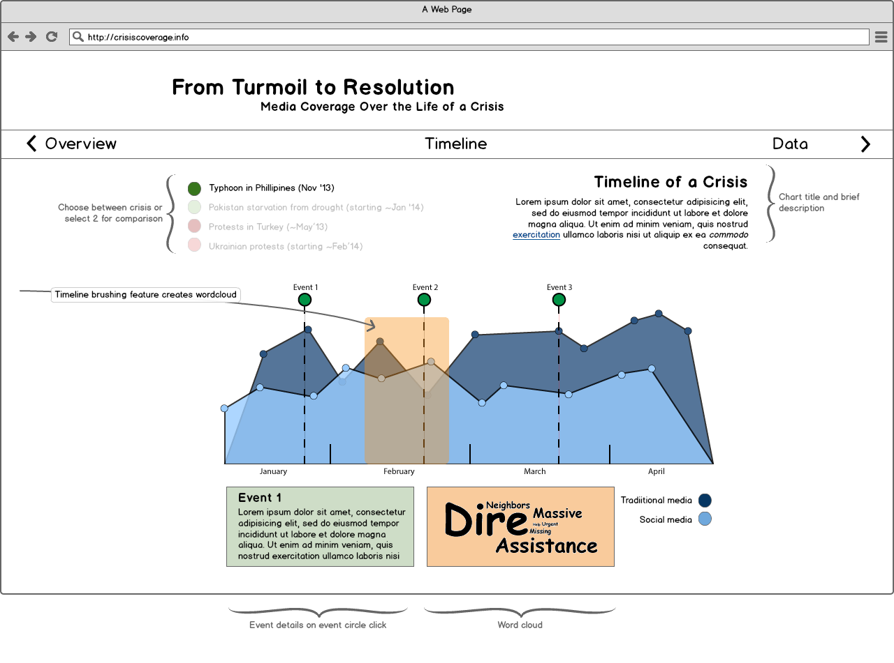

# ["From Turmoil to Resolution: Media Coverage Over the Life of a Crisis"](http://crisiscoverage.info "Crisis Coverage")

### Overview and Motivation: Provide an overview of the  project goals and the motivation for it. Consider that this will be read by people who did not see your project proposal.
#### From our initial proposal:
>__This project will explore the extent and effects of media coverage on a crisis__, distinguishing between traditional and social media providers and further, to the extent data is available, between stakeholders and non-stakeholders. For anyone interested in the effectiveness of humanitarian or disaster engagement / response, our visual products will facilitate user understanding of which events garner media attention; in turn, a user can use our product to identify strategies how to achieve better results. A crisis for our purposes is a destructive event in human history inspiring extraordinary social and/or media attention. We hypothesize that media coverage is correlated to successful crisis resolution such that intensive coverage results in and from more stakeholder energy being exerted to efficiently manage a crisis. Also, we hypothesize that there are detectable indicators throughout the lifespan of a crisis, from onset to resolution, and we further hypothesize that by systematically analyzing and integrating patterns found in multiple crises, future indicators projected from an ongoing crisis may be predicted at a precision correlated to the quality and quantity of comparable analysis. Predictions will be constrained to represent anticipated conformance to or deviation from the lifespan of other compared crises.

We intentionally set broad outlines for the project in our original [proposal](assets/proposal_dalal_hatfield_johns.pdf) until we really had a handle on what data would be reasonable. The ‘Questions’ section offers up what we think is more explorable and where we will attempt to scope our efforts. However, research into the more ponderous questions originally presented would be of benefit on subsequent projects.

(visit our [website](http://www.crisiscoverage.info) to track our progress and see the final product on 01 MAY 2014.)

### Related Work: Anything that inspired you, such as a paper, a web site, visualizations we discussed in class, etc.
Here is some of pages that inspired our implementation.  
1. [NVD3 Stacked Area](http://nvd3.org/examples/stackedArea.html)
2. [World Remittances](http://remittances.herokuapp.com/?en)
3. [Marcos-wescamp (News HeatMap)](http://contrarian.ca/tag/marcos-wescamp/)
4. [Sankey](http://bost.ocks.org/mike/sankey/)
5. [CrossFilter](http://square.github.io/crossfilter/)

#### Milestone-1 Description Follows
There are quite a few, here are some on the processing side of things.  
1. [Pickanews: Media Search](http://www.pickanews.com)
2. [IndexDen]( https://addons.heroku.com/indexden)
3. [ajax-solr](https://github.com/evolvingweb/ajax-solr)
4. [Semantria](http://semantria.com)
5. [Enginuity Search Engine](http://theenginuity.com/)
6. [BackTweets](http://backtweets.com)

### Questions: What questions are you trying to answer? How did these questions evolve over the course of the project? What new questions did you consider in the course of your analysis?  
Here are our current questions (same as Milestone-1), please revisit our answer in Overview and Motivation Section for more of the history.
1. How much coverage is there of a crisis?
2. Where geographically is the coverage coming from?
3. What can be learned about coverage over time?
4. What can be learned about coverage by traditional and non-traditional media?
5. What sentiments can be extracted at various windows of time within a crisis?
6. What are the key story points that shape a crisis?

### Data: Source, scraping method, cleanup, etc.  
 For the latest data writeup, please see [data-overview](productiondata/data-overview.md). Also, please review our production [data tables page](http://crisiscoverage.info/project-data) from our website.

#### Milestone-1 Description Follows
We have made quite a bit of progress since the project effort kicked off. First, we put together a robust [proposal](assets/proposal_dalal_hatfield_johns.pdf). The breadth of hypothesis and potential data sources was necessary until we really understood which few directions we could really pursue. The potentials have boiled down to the more concrete efforts discussed below.

#### Data Ingestion Effort
We were unable to get historic Twitter data and had no clear choices among a number of search providers other than one of the biggies, namely Google, Bing, or Yahoo. A couple of potentials that didn't pan out due to incomplete results and/or lack of API are [BackTweets](http://backtweets.com), [DuckDuckGo](http://duckduckgo.com) and [Farooq (get url)](). We may still re-assess [Enginuity](http://theenginuity.com/) which offers social interest on pages returned in searches as well as [News-Is-Free](http://www.newsisfree.com/). However, we understand our core data source to be Google API search and are building our visualization plan around this understanding. Any additional sources will only be added after main objectives are obtained. More specifically, here is our data objectives:

1. Use [Google Custom Search API (v1)](https://developers.google.com/custom-search/docs/overview) for primary statistical data as it offers total results and can be crawled up to complete results under certain service tiers. We are currently using the free level service which affords 100 queries per day per user, with 10 results per query. However, we have access to increased search results as we deem necessary. The Google API allows a number of restrictions including language, date, and countries which will give us a few outlets for effective visualization of crises coverage.

2. Use a [customized java API client](https://github.com/lukehatfield/crisiscoverage.info/tree/master/crisis-crawler/src/main/java/info/crisiscoverage/crawler) which we wrote in Java for backend processing. This console application wraps around [Crawler4j](http://code.google.com/p/crawler4j/) to crawl any pages identified. Through abstraction and other good software engineering principles, we are able to rapidly implement new source configs to go target different query results from an API or other web-exposed data provider. A configuration is binned on the file structure by first its collection name and further by one or more succinct tag phrases suitable for using in a filename. An instance example is Typhoon Haiyan which is given a unique collection name of “haiyan” and currently has sample data for tag phrase “bbc”, “google-news”, and “google-blogs” which become sub-folders for storage and processing under the collection. A collection name and tag phrase are also the basis for locally unique ids along with any other distinctives that support separation such as result count and page. We have adopted locally unique identifiers for simplicity in implementation and choose to leverage the abstraction principles to generate a new configuration with new tag phases if query results would be in danger of stepping on previous previous. This effort is complete for initial goals.

3. Clean crawled pages for potential text indexing using [Apache Solr](https://lucene.apache.org/solr/‎) or similar and/or [Semantria](http://semantria.com/) for sentiment analysis. We have explored both of these options and have run a small dataset from BBC through Semantria with positive results. We are also interested in word cloud options for results. The cleaning is done by the customized Java client mentioned above.

4. Supply meaningful metadata results for use in front-end visualization products. We currently supply metadata results in a tabular format (as CSV) and operate on a single configuration at a time. As previously mentioned, the configurations are locally scoped to the collection and tag phrase level. Given the consistency in Columns supported in our tabular metadata output, it is quite easy to join results across multiple tables or use the file output separation as series data and handle it separately within the visualization products.  As of 10 APR 2014, we have two major varieties of metadata export -- summary (referenced as `query_stats_only`) and entries, with the latter being further refined into `entries_no_text` and `entries_with_text`. Text is the cleaned text discussed briefly above. Here is the `MetaMode` enum for reference.

```java
public static enum MetaMode {  
  query_stats_only, entries_no_text, entries_with_text;  
//...  
}
```  

Entry metadata consists of up to all of the available column fields, with the only exception being the presence or absence of the `clean_text` column. Here is the `Column` enum for reference.

```java
public static enum Column {  
  query_run_date, query_period, periods_back, days_back, result_count, date_query_start, date_query_end,  
  doc_id, domain, title, date_published, collection, tags, url, summary, clean_text;  
//...  
}
```  

Summary metadata consists of the following subset of column fields (the first 7 from the `Column` enum code snipped shown above):

`query_run_date, query_period, periods_back, days_back, result_count, date_query_start, date_query_end`  

#### Sample Data  
We have attached a compressed [sample](assets/haiyan-9-week-sample.7z) of our current starter queries to separate Google News from Google Blogs. The sample contains partial results of API queries, url crawling, text cleanup, and metadata extraction. The sample focuses on Typhoon Haiyan which struck the Philippines 13 NOV 2013. There are two collections in this sample held in the [google-news] and [google-blogs] folders. Each holds data from 9 weeks around the crisis. The [meta] folder within each provides aggregated metadata extraction with and with clean text as well as pure summary information. Additionally, the [clean] folder contains a stand-alone version of the cleanup results, ready for deeper indexing and analysis. There are other folders that are part of the processing pipeline but these folders are the output side of processing.

Below are the "starter" queries that drove this collection, prior to URL encoding -- we will most certainly be refining these queries now that we have demonstrated viability:  
1. newsQueryVal = `q=typhoon haiyan news OR article OR coverage --blog --weather.com --wikipedia.org`  
2. blogQueryVal =  `q=typhoon haiyan blog --weather.com --wikipedia.org`  

Each query was used populate the general Google Custom Search API (v1), reapeating over the weeks of interest, relative to the date of query which was 10 APR 2014. Here is the query pattern used in calling the API, where of variable %DATERESTRICT% ranged from 'w22' (week prior to crisis) down to 'w14' (~8 weeks after crisis); also, note that %CX% and %KEY% are Google API authorization params and are masked for privacy. :

[google-news] (`numberBack() result --> [days= 154], would be start date: Thu Nov 07 12:08:28 EST 2013`)  
```
https://www.googleapis.com/customsearch/v1?hl=en&alt=atom&dateRestrict=__%DATERESTRICT%__&q=typhoon%20haiyan%20news%20OR%20article%20OR%20coverage%20--blog%20--weather.com%20--wikipedia.org&cx=__%CX%__&safe=high&key=__%KEY%__&num=10&start=1
```

[google-blog] (`numberBack() result --> [days= 154], would be start date: Thu Nov 07 12:08:28 EST 2013`)  
```
https://www.googleapis.com/customsearch/v1?hl=en&alt=atom&dateRestrict=__%DATERESTRICT%__&q=typhoon%20haiyan%20blog%20--weather.com%20--wikipedia.org&cx=__%CX%__&safe=high&key=__%KEY%__&num=10&start=1
```

_Note: In order to keep the sample light-weight, for each week of the 9 queried, only the first 10 results have been returned and processed. So, this is not complete in any stretch but the metadata does offer a blunt instrument. And in its entirety (along with other concepts and more robust samples) this should demonstrate that we have a solid handle on addressing data needs of the project._

#### Next Data Steps
1. Use the Google API `cr` param to restrict to countries and build TBD choropleths from the results.  We will be able to get a single number per period queried up to the entire crisis. The power of this approach is that each crisis only requires 1 query per period per country to use in our choropleth, so if we look at the top 25 countries in the world, only 25 queries are required to build our total aggregate choropleth. Further, if we want to show country responses over time, we can run 10 weekly queries per country and achieve desired results in only 250 total queries. This is a very obtainable result. One challenge will be the search terms across languages as was mentioned in the [design studio](design_studio_feedback.md) discussion, so we will consider the effectiveness of non-english languages being included in in results.

2. Via the Google API, we are heavily considering crawling the corpus of select sites, such as [Top 15 Traditional News Sites](http://www.ebizmba.com/articles/news-websites) and same number of non-traditional / social media equivalents. By doing a direct comparison of known quantities, a controlled sampling of the myriad possible results, we expect to work-around the otherwise opaque nature of sorting out social from traditional media via terms -- especially if we hope to remain in the free service tier and hope to avoid intensive crawling endeavors. By taking a domain focused approach similar to the previously mentioned country strategy, we will get the same frequency information in 1 query per domain per period, but we can also crawl the crisis related information on the domains which will be of importance to the next discussion point.

3. Make use of unstructured indexing / sentiment analysis / word clouds.  This falls out of strategic crawling as discussed above as we certainly do not want to try and bite off too much.

4. Introduce crisis comparisons. After we are able to fully visualize a single crisis, we hope to then introduce additional crises with TBD comparison tools.  

### Exploratory Data Analysis: What visualizations did you use to initially look at your data? What insights did you gain? How did these insights inform your design?
We had a running catalog of visualizations from the course lectures and from d3 oriented sites. The initial mock-up which included the line chart, story points, and brush and link behavior for sentiment or word cloud or similar behavior came to the group nearly immediately as a really good fit for our goals. The data exploration itself was quite dicey. Our original project proposal had many sources that ultimately were not going to be predictably useful, either because the results were sparse or were too opaque to compare among datasets. Additionally, the crawling exploratory efforts were marked with challenges as well. A promising black-box solution [Crawl Anywhere](http://www.crawl-anywhere.com/download-crawl-anywhere/) turned out to have to many issues for our purposes and we ultimately abandoned it in favor of the solution laid out in the ‘Data’ section.

### Design Evolution What are the different visualizations you considered? Justify the design decisions you made using the perceptual and design principles you learned in the course.

Please reference the following section for implemented design decisions.

#### Milestone-1 Description Follows
Initially we considered a worldmap that would show locations of Twitter data that related to a certain 'crisis.' When we realized Twitter data is unavailable past one week, we realized we would have to show less geographic data and more 2d chart data. A timeline was suggested to show crisis media according to its published date. The following is an image of our initial sketch.


We refined this initial sketch using [Balsamiq Mockups](http://balsamiq.com/products/mockups/ "Balsamiq Mockups"). This version is substantially the same, but gave an idea of the page layout on the project site.



All three of us were interested in leveraging the geo-data that would come with our search results. Not only were interested in leveraging D3's world map projection capabilities, but we thought it would add another dimension to our data analysis and give the user another avenue of exploration and discovery. The following was our initial geo-bubble sketch, although after our recent discoveries of Google API's country specific search results, we may be changing this to a country specific choropleth version that shows media engagement in a crisis by country.


Finally we wanted to add a granular level of engagement with the data, so we threw together a rough sketch showing interactivity with actual search results.


This is not our primary visualization and may take on a new form as we refine our search results and establish specific avenues for audience engagement. Our [design studio](design_studio_feedback.md) partner group thought this page would be of particular interest to the audience as we have a broad topic and the implementation is unique. This course makes it clear we have many types of audience members, some of which may be more interested in 'how' we arrived at our conclusions just as much as 'what' the conclusions were.

### Implementation Describe the intent and functionality of the interactive visualizations you implemented. Provide clear and well-referenced images showing the key design and interaction elements.

The primary driver over the design evolution was working within constraints presented by available data, namely the limitations of Google Custom Search API, which we discuss in the Data section. However, as we settled into the strengths and weaknesses of the available data, we thought quite carefully about how to best represent the data, being very careful to not be misleading in our visualizations.

#### World
The sankey diagram on the 'Crisis Compared' Tab, stood out as a very powerful way to learn more about how top ten countries change, or do not change in some instances, from one crisis to another. The results are quite interesting with a total of 20 countries participating in varying levels in the top-ten over one or more crises.


Further on the 'Map' Tab, the choropleth showing quantized country representation for a given crisis offers utility for a user seeking to gauge the  geographic spread for a crisis at a glance.


The isolation effect on click to reduce the opacity of all countries not having the same quantized color value also works well to assist users in sense-making as they scan the choropleth, e.g. Germany and Canada in the example below.


Finally for 'World', the 'Bar Chart' Tab allows a full ranking of country results and is sortable by 'rank' or 'country' name descending / ascending. The visualization supplies a more comprehensive comparison of results for a crisis in absolute or numerical terms.


#### Timeline
The Timeline Page contains three tabs which portray our media analysis through three different visualizations. The overall goal was to show the media coverage against the backdrop of a larger narrative of key defining events in the lifespan of the crisis. 
The line charts are arranged with results on the y-axis and temporal on the x-axis served us well on the 'Timeline' Page.

The first Tab, 'Crises Compared', displays the percentage in change in article coverage per crisis month to month.  Overall we found the coverage to decrease steadily after the initial starting point of the crisis. The main exception however was Typhoon Haiyan, which had a 19% increase in coverage in month 3 following the initial disaster. We believe that this is due to two reasons. First, Typhoon Haiyan was very visible in media due to the scope of damage and destruction. Second, continued efforts by government and aid agencies for humanitarian response kept the media coverage going. 


The 'By Media Type' Tab shows the coverage of the crisis over a timeline and against a backdrop of narrative story points. The story points are denoted by the upside down gray triangles. The primary purpose of this tab is the highlight the difference in coverage by the media types we chose, that is: Traditional (e.g. CNN, NYTimes, etc), Blog-Social (e.g. Reddit), and Independent (e.g. The Daily Beast). In general we show spikes in coverage around the narrative story point events and a general downward slope across all three types of media sources. In general the Blog-Social category were significantly inflated compared to Traditional media and Independent media. This can be explained by the fact that many of the blogging sites are content driven and gain value through reposting and user clicks. Therefore it’s likely that the blog-social were often reposting of either existing articles or other blog posts.   


Similar to the 'By Media Type' Tab, the 'By Source' Tab shows the coverage of the crisis by media source. You can click to show/hide media sources on the timeline. Hovering over the line graph, you can see per month the total number of articles published by each media source pertaining to the crisis. Additionally, the same storypoint convention as with 'By Media Type' is employed, with a storypoint from Typhoon Haiyan indicated in the screenshot below.


#### Detail
The 'Detail' Page, as the name implies, intends to show more details about the data we gathered. For this this page, we created a custom json that aggregated the 8 different source files produced by the crawler and indexed by month, type, and media source. Using the crossfilter.js, we were able to perform fast searches on the page as well for both displaying the stacked bar chart as well as retrieving the pertinent articles in the article explorer. 

The purpose of this bar chart was two-fold. First was to show relative to each other, how much each media source covered the crisis by month. To accommodate for vast differences in the absolute counts, i.e. Blogspot had often over 1,000 articles which hid media sources like New York Time which published about 10 or so articles, we used a power squared scale to adjust the bar sizes. Second, the tool tip provides further detail on the absolute count of the articles published by the media source as well as a baseline number of overall articles published by the media source. This ration of articles related to the crisis vs overall articles will give the audience an idea of how much market share the crisis occupied in the news cycles for that media source. 


Upon clicking on any part of the bars, a secondary interactive table is presented with the sample results for the crisis within the month selected in a dialog we call the 'Article Explorer'. By clicking on the bar, the article explorer pops up and presents a sample set of articles per news source, about 10 results per site per month. The dialog is pre-filtered by the media source that was clicked. The article explorer also supports dynamic searching to filter articles by source, month, and key words. We would like to point out these are not total results but about 10 results per site per month as we really didn't have the capacity to rehost a chunk of Google.


#### Milestone-1 Description Follows


The image above shows our current working state of the timeline visualization. This is visible on our [website](http://crisiscoverage.info 'CrisisCoverage.info'). You can see the crisis summary (a), the number of traditional or non-traditional query results (b), key story points (c), the data source picker (d), and the legend (e). 

* (a) The crisis summary area is also a placeholder for the storypoints (c). When a storypoint is hovered, the info in the crisis summary area changes to display details of the hovered storypoint. We wanted this to be a 'narrative' visualization that tells a story and leaves little unexplained. 

* It should be added that upon mouseover of the data points (b) on the area chart, specific query result numbers are shown in a tooltip with the associated date.

* The data source picker (d) allows the audience to select different data sources and update the graph automatically. At the present time this feature uses two graphs and removes one when the other is called. As we finalize our data structure, multiple data sources will resemble each other more closely and hopefully allow for smooth transitions between data views.

* Finally, our legend (e) describes the colors chosen for either 'traditional' or 'non-traditional' data queries.

One word on the website layout itself: we were inspired by this d3 [example](http://remittances.herokuapp.com/?en "Worldwide remittance flows") and its horizontal navigation. This nav style has yet to be implemented on our site, but we do try to impress the equivalent nature of our three main views. 

We also intend to structure a high-level overview, a mid-level timeline view, and a granular level data view. We hope these three views will give a wider audience something interesting to discover while taking maximum advantage of our data-gathering efforts by employing the results in a variety of forms.

### Evaluation: What did you learn about the data by using your visualizations? How did you answer your questions? How well does your visualization work, and how could you further improve it?  

* For starters, we quickly learned the importance of good data and the constraints imposed by data quality. Our eventual implementation was very carefully thought through from data implications. We wanted to represent the actual information available and tried our very best to establish clear analytic and exploratory products and had to shy away from some of our loftier early vision due to a lack of support in the data. There were several challenging aspects of this project. The first was to acquire historical news data. Unfortunately, it was rather difficult to a get a well defined dataset based on either existing APIs or data set. Also we ran into a significant hurdle when we found we couldn’t acquire historical Twitter data that was more than a week old. All that data was locked away behind pay wall services owned by private groups that were mainly interested in selling social data to enterprises. Our group eventually tackled that challenge using the Google Search API and a custom web crawler. Unfortunately, we were severely hampered by Google’s API which did create logistical as well as analytical challenges. Our early prototyping efforts had a wonderful scrape of BBC data where there were many spikes in coverage that we could identify from the publication information. Unfortunately, Google API is very spotty on publication information and really only monthly results are dependable as the weekly queries ultimately were non-nonsensical when taken in aggregate. These challenges are documented in the data section our process document in detail. Ideally we would have liked start with a more stable dataset which would have given us more time to investigate the visualization aspect of our project.

* We learned visualizations give a completely different picture than what you may initially expect from the data, especially data as viewed in tabular / near raw form. Visualizations let us quickly identify outlier data as well as trends. For example, the increase in article coverage on the Haiyan crisis as witnessed on the Timeline page was unique and unexpected, but very visible with the crisis compared visualization.

* We were able to explore most of the questions we set out to explore. However, our research also raised more questions such as, "What exactly is a social-blog article?" and "What exactly does the Google API return on queries?" In the end, we had to respect the opacity and engage on the data's terms as has already been mentioned. The one visualization we were unable to implement was the sentiment analysis. We were able to devise an algorithm to pull out frequently used words in the 3000+ articles we had collected through our crawler. However, we faced a bit of technical challenge with asynchronous calls that made it difficult to print out the json dataset. It was hard time the print function with when the algorithm finished parsing all 3000+ documents. We also investigated using Semantria to do textual analysis but found it was a bit limited in only telling if an article was positive, neutral, or negative.
 
* Our visualizations effectively graph the data we have. The graphs range from high level comparison overviews  down to the granular engagement with near raw data. That being said, our visualizations did come out well. The world section showed multiple views about how media coverage for a crisis was distributed around the world. It was fascinating to see which countries were prominent in covering a crisis (i.e. US, UK, Canada, and India) vs which countries were focused on crises in their backyards (e.g. Malaysia). The Timeline visualization provided the thrust of our narrative component and helped explore the questions like “What can be learned about coverage over time? 4. What can be learned about coverage by traditional and non-traditional media?”. In general we found that regardless of crisis type, media coverage generally tapered down after the first month of the crisis. High impact crises like Typhoon Haiyan were more likely to garner more coverage possibly due to the shock factor of the death and destruction it brought with it. In contrast longer crises like the Pakistan drought or the revolutions in Turkey and Ukraine had overall lower coverage, as well as waning coverage over the following months. It was interesting to the often there was more coverage of crisis in the Blog-Social sphere than in the Traditional sphere, suggesting that media reporting has significantly evolved in the past decade.

* All in all this has been a rewarding, though intensive, project; the effort has solidified our understanding of how to better design and implement visually products that are both honest and compelling. We look forward to further applying these acquired skills in other academic and professional ventures.